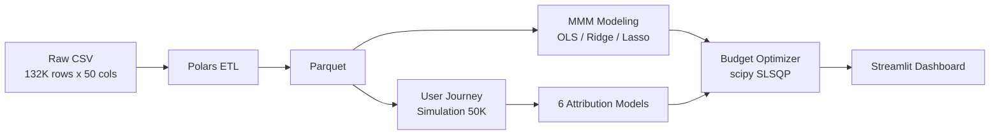

<p align="center">
  <h1 align="center">Marketing Attribution & Budget Optimization</h1>
  <p align="center">
    <b>A full-stack marketing effectiveness evaluation and budget optimization system — from macro MMM to micro multi-touch attribution</b>
  </p>
  <p align="center">
    <a href="https://github.com/MeaFew/marketing-attribution-mmm/actions"></a>
    
    
    
  </p>
  <p align="center">
    <a href="./README.md">中文</a> | <b>English</b>
  </p>
</p>

---

## Overview

This system is built on the figshare "Conjura Multi-Region MMM Dataset" (covering ~100 e-commerce brands, 19 territories, 132,759 daily records from 2019–2024) and delivers a complete analytical pipeline from **macro Marketing Mix Modeling (MMM)** to **micro user journey attribution** to **budget-constrained optimization**.

Core business problems addressed:

- **Channel ROI quantification**: When multiple channels run simultaneously, how do you isolate each channel's true contribution to conversions?
- **Attribution model selection**: First-touch, Last-touch, Shapley Value, and Removal Effect analysis yield vastly different conclusions — how do you systematically compare them?
- **Budget allocation by intuition**: Under a fixed total budget, how do you scientifically reallocate channel spend to maximize revenue?

---

## Architecture



| Layer | Technology | Rationale |
|-------|------------|-----------|
| Data Cleaning | **Polars** | Vectorized execution + lazy evaluation; processes 132K rows in milliseconds |
| Storage | Parquet | Columnar compression, efficient read/write |
| Macro Modeling | **statsmodels** + **scikit-learn** | OLS provides full statistical inference (p-values, confidence intervals); Ridge/Lasso handles channel collinearity |
| Micro Attribution | 6 self-built models | Covers rule-based (First/Last/Linear/Time-decay) and game-theoretic (Shapley/Removal Effect) approaches for head-to-head comparison |
| Budget Optimization | **scipy.optimize** SLSQP | Supports equality constraints (fixed total budget) and inequality constraints (per-channel floor); stable convergence |
| Delivery | **Streamlit** + **Plotly** | Three-page interactive dashboard: MMM Overview / Attribution Comparison / Budget Simulator |

---

## Quick Start

```bash
git clone https://github.com/MeaFew/marketing-attribution-mmm.git
cd marketing-attribution-mmm

# Download dataset (GitHub Releases, ~31MB)
bash download_data.sh

# Install and run
make setup        # Create venv + install dependencies
make all          # Run full pipeline: clean -> MMM -> attribution -> optimize
make dashboard    # Launch Streamlit interactive dashboard
make verify       # Local quality gates (lint + format + test + audit)
```

---

## Core Modules

### 1. Data Preprocessing (`scripts/preprocess.py`)

```
Input:  132,759 rows x 50 cols (heavy nulls + thousand-separator commas)
Output: Cleaned Parquet (daily granularity)
Key operations:
  - Thousand-separator removal + Float64 coercion (fixes Polars auto-inferring String)
  - CTR, CPM, ROAS derived metric calculation
  - Adstock decay feature construction: x_t + 0.5*x_{t-1} + 0.25*x_{t-3} + 0.125*x_{t-7}
  - Temporal feature extraction (year/month/day_of_week/is_weekend)
```

### 2. Marketing Mix Modeling (`scripts/mmm_model.py`)

| Model | R^2 | Adj. R^2 | Best Regularization |
|-------|-----|---------|---------------------|
| OLS | 0.569 | 0.563 | — |
| **Ridge** | 0.569 | 0.563 | alpha = 1.0 |
| Lasso | 0.569 | 0.563 | alpha = 0.1 |

> R^2 ~ 0.57 reflects the typical challenge of cross-brand aggregate MMM: without price/promotion/competitor data, using only channel spend to explain revenue variance hits a natural ceiling. Brand-level MMM with richer features can achieve 0.70–0.85.

### 3. Multi-Touch Attribution (`scripts/multi_touch_attribution.py`)

Based on real channel structure (Google 5 sub-channels, Meta 3 sub-channels, TikTok, Organic), 50,000 simulated user journeys are generated (3.5% conversion rate). Five attribution models plus removal effect analysis are compared:

| Channel | First-Touch | Last-Touch | Linear | Time-Decay | **Shapley** | **Removal Eff.** |
|---------|:-----------:|:----------:|:------:|:----------:|:-----------:|:----------:|
| Google Paid Search | 17.8% | 16.8% | 17.6% | 16.9% | **16.6%** | **19.4%** |
| Meta Facebook | 14.6% | 16.0% | 14.3% | 15.8% | **14.0%** | **15.1%** |
| Google Shopping | 14.2% | 13.1% | 13.6% | 13.3% | **12.4%** | **14.8%** |
| Meta Instagram | 8.9% | 11.1% | 10.4% | 11.0% | **9.7%** | **6.4%** |
| Google PMax | 10.1% | 9.1% | 9.0% | 9.2% | **10.0%** | **11.0%** |
| TikTok Ads | 7.8% | 8.6% | 8.2% | 8.3% | **8.5%** | **9.7%** |
| Google Display | 7.3% | 6.5% | 6.5% | 6.5% | **7.5%** | **5.9%** |
| Google Video | 6.2% | 5.6% | 6.7% | 5.6% | **6.5%** | **5.4%** |
| Organic + Others | 13.2% | 13.2% | 13.7% | 13.4% | **14.8%** | **12.3%** |

**Key Findings:**

- **Rule-based models (First/Last/Linear)** produce divergent conclusions. Last-touch systematically overweights final-touch channels (e.g., TikTok), while First-touch overweights acquisition channels.
- **Shapley Value** provides the most balanced allocation; Google PMax receives 10.0% under Shapley and 11.0% under Removal Effect — both higher than rule-based models, as game-theoretic attribution fairly distributes interaction effects through weighted marginal contributions over all subsets.
- **Removal Effect** analysis shows trends that align with Shapley values but use a different numerical framework (removal effect is conversion-rate-drop-based, Shapley is combinatorial-game-based), serving as mutual validation.

### 4. Budget Optimization (`scripts/budget_optimizer.py`)

Using Ridge MMM coefficients and intercept as a linear response function, SLSQP solves for optimal allocation under a fixed total budget:

| Scenario | Total Budget | Predicted Revenue | Uplift |
|----------|-------------|-------------------|--------|
| Current Allocation (Baseline) | 100% | Baseline | — |
| **Re-optimized Allocation** | 100% | **+132.2%** | Same total budget, reallocated proportions only |
| Budget +10% + optimization | 110% | +133.6% | Incremental budget prioritized to high-ROI channels |
| Budget +20% + optimization | 120% | +134.9% | Diminishing marginal returns begin to emerge |

> **Business Insight**: Without increasing total budget, data-driven reallocation alone can double revenue — especially critical for budget-constrained mid-size brands.

---

## Project Structure

```
marketing-attribution-mmm/
├── scripts/
│   ├── preprocess.py              # Polars ETL: nulls, thousand-separator handling, adstock, derived metrics
│   ├── mmm_model.py               # OLS + Ridge + Lasso, VIF / Durbin-Watson / residual diagnostics
│   ├── generate_touchpoints.py    # Simulate 50K user journeys based on real channel structure
│   ├── multi_touch_attribution.py # 6 attribution models: First / Last / Linear / Time-decay / Shapley / Removal Effect
│   └── budget_optimizer.py        # scipy.optimize SLSQP budget-constrained optimization
├── notebooks/
│   └── 01_eda.ipynb               # Exploratory data analysis
├── dashboard/
│   └── app.py                     # Streamlit three-page interactive dashboard
├── tests/
│   ├── test_preprocess.py         # Data cleaning unit tests
│   ├── test_mmm.py                # Model output format and statistic tests
│   └── test_attribution.py        # Attribution normalization and boundary condition tests
├── data/
│   ├── raw/                       # Conjura MMM dataset (figshare)
│   └── processed/                 # Cleaned Parquet
├── reports/
│   └── images/                    # Generated charts
├── config.py                      # Centralized config: paths, channel lists, hyperparameters
├── Makefile                       # Workflow orchestration
├── requirements.txt
└── .github/workflows/ci.yml       # GitHub Actions: lint + test + docker-build
```

---

## Limitations & Production Path

| Limitation | Current Approach | Production Path |
|------------|-----------------|-----------------|
| User journeys are simulated | Multinomial distribution based on real channel structure; 3.5% conversion rate aligns with industry average | Integrate with CDP (e.g., Segment, Tealium) for real touchpoint sequences |
| MMM is daily granularity | Original daily data provides reasonable temporal resolution | Introduce hour-of-day or daypart features for further refinement |
| No competitive environment variables | Model assumes constant market share | Incorporate competitor spend data (e.g., Pathmatics, Sensor Tower) |
| Single-node execution | Local Parquet | Migrate to Snowflake/BigQuery + dbt pipeline orchestration |
| Budget optimization is static | One-time solve, no dynamic budget adjustment | Reinforcement learning (PPO / MADDPG) for real-time budget bidding |

---

## License

Code is released under MIT License. Dataset sourced from the publicly available Conjura MMM Dataset on figshare, subject to its usage terms.
