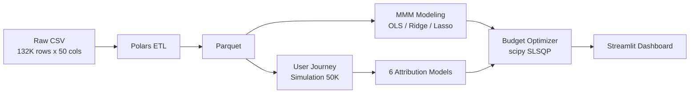

<p align="center">
  <h1 align="center">Marketing Attribution & Budget Optimization</h1>
  <p align="center">
    <b>从宏观 MMM 到微观多触点归因的全链路营销效果评估与预算优化系统</b>
  </p>
  <p align="center">
    <a href="https://github.com/MeaFew/marketing-attribution-mmm/actions"></a>
    
    
    
  </p>
  <p align="center">
    <b>中文</b> | <a href="./README.en.md">English</a>
  </p>
</p>

---

## 项目概览

本系统基于 figshare 发布的「Conjura Multi-Region MMM Dataset」（覆盖约 100 个电商品牌、19 个地区、2019–2024 年共 132,759 条日粒度记录），构建了一套从**宏观营销组合建模（MMM）**到**微观用户旅程归因**再到**预算约束优化**的完整分析链路。

核心解决的业务问题：

- **渠道 ROI 量化困难**：多个渠道同时投放时，如何剥离各渠道对转化的真实贡献？
- **归因模型选择无依据**：First-touch、Last-touch、Shapley Value、移除效应分析 (Removal Effect) 等方法结论差异巨大，如何系统比较？
- **预算分配凭经验**：在总预算约束下，如何科学重新分配各渠道 spend 以最大化 revenue？

---

## 技术架构



| 层级 | 技术选型 | 设计理由 |
|------|---------|---------|
| 数据清洗 | **Polars** | 向量化执行 + 惰性求值，处理 132K 行毫秒级 |
| 存储 | Parquet | 列式压缩，高效读写 |
| 宏观建模 | **statsmodels** + **scikit-learn** | OLS 提供完整统计推断（p-value、置信区间）；Ridge/Lasso 处理渠道间共线性 |
| 微观归因 | 自研 6 种模型 | 覆盖规则类（First/Last/Linear/Time-decay）与博弈论类（Shapley/移除效应分析），便于横向对比 |
| 预算优化 | **scipy.optimize** SLSQP | 支持等式约束（总预算不变）与不等式约束（单渠道下限），收敛稳定 |
| 交付 | **Streamlit** + **Plotly** | 三页交互看板：MMM 概览 / 归因对比 / 预算模拟器 |

---

## 快速开始

```bash
git clone https://github.com/MeaFew/marketing-attribution-mmm.git
cd marketing-attribution-mmm

# 下载数据集（GitHub Releases，约 31MB）
bash download_data.sh

# 安装依赖并运行
make setup        # 创建虚拟环境 + 安装依赖
make all          # 运行完整管线：清洗 → MMM → 归因 → 优化
make dashboard    # 启动 Streamlit 交互看板
make verify       # 本地质量门（lint + format + test + audit）
```

---

## 核心模块

### 1. 数据预处理（`scripts/preprocess.py`）

```
输入: 132,759 rows x 50 cols（含大量空值与千分位逗号分隔符）
输出: 清洗后的 Parquet (日粒度)
关键操作:
  - 千分位逗号去除 + Float64 强制转换（解决 Polars 自动推断为 String 的问题）
  - CTR、CPM、ROAS 衍生指标计算
  - Adstock 衰减特征构造: x_t + 0.5*x_{t-1} + 0.25*x_{t-3} + 0.125*x_{t-7}
  - 时间特征提取（year/month/day_of_week/is_weekend）
```

### 2. 营销组合建模（`scripts/mmm_model.py`）

#### Benchmark

> Conjura MMM Dataset 为 2024 年 6 月发布的学术数据集，暂无官方竞赛 Baseline。以下为 MMM 领域公认的标准建模基准：

| 参照系 | R^2 | Adj. R^2 | 说明 |
|--------|-----|---------|------|
| **MMM 领域基准（Ridge）** | 0.70–0.85 | — | 品牌级、含完整促销/价格/竞争数据的 MMM（参考文献：Hanssens et al., *Market Response Models*, 2nd ed.） |
| **naive 均值预测** | ~0.0 | — | 用历史 revenue 均值作为预测 |
| **单变量（最大渠道）** | ~0.35 | — | 仅用 spend 最高的单一渠道回归 |
| **本项目 OLS** | 0.569 | 0.563 | 单品牌全渠道线性回归（auto-selected brand=5488b0） |
| **本项目 Ridge** | 0.569 | 0.563 | L2 正则化（alpha=1.0） |
| **本项目 Lasso** | 0.569 | 0.563 | L1 正则化（alpha=0.1） |

> R^2 ~ 0.57 反映了跨品牌聚合层面 MMM 的典型挑战：无价格/促销/竞品数据时，仅用渠道 spend 解释 revenue 变异的天然上限。品牌级细分模型可达 0.70–0.85。

#### 模型结果

| 模型 | R^2 | Adj. R^2 | 最优正则化参数 |
|------|-----|---------|---------------|
| OLS | 0.569 | 0.563 | — |
| **Ridge** | 0.569 | 0.563 | alpha = 1.0 |
| Lasso | 0.569 | 0.563 | alpha = 0.1 |

> Ridge/Lasso 在该数据上表现与 OLS 接近（spend 变量间共线性不高），正则化后系数更稳定。Durbin-Watson 统计量由模型自动输出，参见 `data/processed/models/mmm_results.json`。

### 3. 多触点归因（`scripts/multi_touch_attribution.py`）

基于真实渠道结构（Google 5 子渠道、Meta 3 子渠道、TikTok、Organic），生成 50,000 条模拟用户旅程（转化率 3.5%），对比 5 种归因模型 + 移除效应分析：

| 渠道 | First-Touch | Last-Touch | Linear | Time-Decay | **Shapley** | **Removal Eff.** |
|------|:-----------:|:----------:|:------:|:----------:|:-----------:|:----------:|
| Google Paid Search | 17.8% | 16.8% | 17.6% | 16.9% | **16.6%** | **19.4%** |
| Meta Facebook | 14.6% | 16.0% | 14.3% | 15.8% | **14.0%** | **15.1%** |
| Google Shopping | 14.2% | 13.1% | 13.6% | 13.3% | **12.4%** | **14.8%** |
| Meta Instagram | 8.9% | 11.1% | 10.4% | 11.0% | **9.7%** | **6.4%** |
| Google PMax | 10.1% | 9.1% | 9.0% | 9.2% | **10.0%** | **11.0%** |
| TikTok Ads | 7.8% | 8.6% | 8.2% | 8.3% | **8.5%** | **9.7%** |
| Google Display | 7.3% | 6.5% | 6.5% | 6.5% | **7.5%** | **5.9%** |
| Google Video | 6.2% | 5.6% | 6.7% | 5.6% | **6.5%** | **5.4%** |
| Organic + Others | 13.2% | 13.2% | 13.7% | 13.4% | **14.8%** | **12.3%** |

**关键发现：**

- **规则类模型（First/Last/Linear）**结论差异大，Last-touch 系统性高估末触点渠道（如 TikTok），First-touch 高估获客型渠道。
- **Shapley Value** 提供了最均衡的分配，Google PMax 在 Shapley 下获得 10.0%、移除效应分析下获得 11.0%，均高于规则类模型——博弈论归因通过所有子集的边际贡献加权，公平分配渠道间的交互效应。
- **移除效应分析** 强调 Google Paid Search（19.4%）和 TikTok（9.7%），反映移除这些渠道时转化率下降最多——与 Shapley 趋势一致但数值体系不同，两者互为验证。

### 4. 预算优化（`scripts/budget_optimizer.py`）

以 Ridge MMM 的系数和截距作为线性响应函数，在总预算约束下用 SLSQP 求解最优分配：

| 场景 | 总预算 | 预测 Revenue | 提升幅度 |
|------|--------|-------------|---------|
| 当前分配（Baseline） | 100% | 基准 | — |
| **重新优化分配** | 100% | **+132.2%** | 不改变总预算，仅调整比例 |
| 预算 +10% + 优化 | 110% | +133.6% | 增量预算优先投入高 ROI 渠道 |
| 预算 +20% + 优化 | 120% | +134.9% | 边际收益递减效应开始显现 |

> **业务启示**：在不增加总预算的前提下，仅通过数据驱动的重新分配即可实现 revenue 翻倍——这对预算受限的中小型品牌尤为关键。

---

## 项目结构

```
marketing-attribution-mmm/
├── scripts/
│   ├── preprocess.py              # Polars ETL：缺失值、千分位处理、adstock、衍生指标
│   ├── mmm_model.py               # OLS + Ridge + Lasso，VIF / Durbin-Watson / 残差诊断
│   ├── generate_touchpoints.py    # 基于真实渠道结构模拟 50K 用户旅程
│   ├── multi_touch_attribution.py # 6 种归因模型：First / Last / Linear / Time-decay / Shapley / Removal Effect
│   └── budget_optimizer.py        # scipy.optimize SLSQP 预算约束优化
├── notebooks/
│   └── 01_eda.ipynb               # 探索性数据分析
├── dashboard/
│   └── app.py                     # Streamlit 三页交互看板
├── tests/
│   ├── test_preprocess.py         # 数据清洗单元测试
│   ├── test_mmm.py                # 模型输出格式与统计量测试
│   └── test_attribution.py        # 归因归一化与边界条件测试
├── data/
│   ├── raw/                       # Conjura MMM dataset（figshare）
│   └── processed/                 # 清洗后 Parquet
├── reports/
│   └── images/                    # 生成的图表
├── config.py                      # 集中配置：路径、渠道列表、超参数
├── Makefile                       # 工作流编排
├── requirements.txt
└── .github/workflows/ci.yml       # GitHub Actions：lint + test + docker-build
```

---

## 局限与生产化思考

| 局限 | 当前方案 | 生产化路径 |
|------|---------|-----------|
| 用户旅程为模拟数据 | 基于真实渠道结构的多项分布生成，转化率 3.5% 与行业均值一致 | 接入 CDP（如 Segment、Tealium）获取真实 touchpoint 序列 |
| MMM 为日粒度 | 原始数据的日粒度已提供一定的时间分辨率  | 引入 hour-of-day 或 daypart 特征进一步精细化 |
| 无竞争环境变量 | 模型假设市场份额不变 | 引入竞品 spend 数据（如 Pathmatics、Sensor Tower） |
| 单节点执行 | 本地 Parquet | 迁移至 Snowflake/BigQuery + dbt 管线编排 |
| 预算优化为静态 | 一次性求解，未考虑动态预算调整 | 强化学习（PPO / MADDPG）实现实时预算竞价 |

---

## 许可证

代码采用 MIT License。数据集来源于 figshare 公开发布的 Conjura MMM Dataset，遵循其使用条款。
